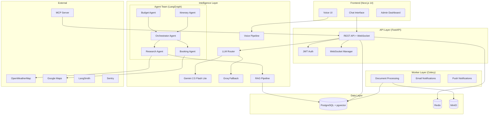
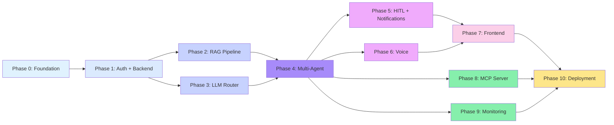

# PariKrama — Master Implementation Plan

## Agentic AI Travel Planning Orchestrator

> **A user says "Delhi to Manali, 5 days, ₹15,000" — and the system spawns 5 AI agents that research, book, optimize, and deliver a complete itinerary with PDF export, voice support, and real-time updates.**

---

## System Architecture Overview



---

## Phase Summary Table

| Phase | Name | Dependencies | Est. Time (Solo Dev) | Status |
|:-----:|------|:------------:|:-------------------:|:------:|
| **0** | [Foundation & Project Setup](file:///C:/Users/HP/.gemini/antigravity-ide/brain/4defd406-b861-4900-9bfb-6aac8c8e851d/phase_00_foundation.md) | None | **3-4 days** | ⬜ |
| **1** | [Backend Core + Authentication](file:///C:/Users/HP/.gemini/antigravity-ide/brain/4defd406-b861-4900-9bfb-6aac8c8e851d/phase_01_backend_auth.md) | Phase 0 | **4-5 days** | ⬜ |
| **2** | [RAG Pipeline + Knowledge Base](file:///C:/Users/HP/.gemini/antigravity-ide/brain/4defd406-b861-4900-9bfb-6aac8c8e851d/phase_02_rag_pipeline.md) | Phase 1 | **4-5 days** | ⬜ |
| **3** | [LLM Router + Agent Foundation](file:///C:/Users/HP/.gemini/antigravity-ide/brain/4defd406-b861-4900-9bfb-6aac8c8e851d/phase_03_llm_router.md) | Phase 1 | **3-4 days** | ⬜ |
| **4** | [Multi-Agent System (LangGraph)](file:///C:/Users/HP/.gemini/antigravity-ide/brain/4defd406-b861-4900-9bfb-6aac8c8e851d/phase_04_multi_agent.md) | Phase 2, 3 | **6-8 days** | ⬜ |
| **5** | [Human-in-the-Loop + Notifications](file:///C:/Users/HP/.gemini/antigravity-ide/brain/4defd406-b861-4900-9bfb-6aac8c8e851d/phase_05_hitl_notifications.md) | Phase 4 | **4-5 days** | ⬜ |
| **6** | [Voice Pipeline](file:///C:/Users/HP/.gemini/antigravity-ide/brain/4defd406-b861-4900-9bfb-6aac8c8e851d/phase_06_voice_pipeline.md) | Phase 4 | **5-6 days** | ⬜ |
| **7** | [Frontend (Next.js)](file:///C:/Users/HP/.gemini/antigravity-ide/brain/4defd406-b861-4900-9bfb-6aac8c8e851d/phase_07_frontend.md) | Phase 5, 6 | **7-9 days** | ⬜ |
| **8** | [MCP Server](file:///C:/Users/HP/.gemini/antigravity-ide/brain/4defd406-b861-4900-9bfb-6aac8c8e851d/phase_08_mcp_server.md) | Phase 2, 4 | **2-3 days** | ⬜ |
| **9** | [Monitoring + Observability](file:///C:/Users/HP/.gemini/antigravity-ide/brain/4defd406-b861-4900-9bfb-6aac8c8e851d/phase_09_monitoring.md) | Phase 4 | **3-4 days** | ⬜ |
| **10** | [Production Deployment](file:///C:/Users/HP/.gemini/antigravity-ide/brain/4defd406-b861-4900-9bfb-6aac8c8e851d/phase_10_deployment.md) | All phases | **3-4 days** | ⬜ |

> **Total Estimated Time: ~45-57 days for a solo developer**
> (Some phases can overlap — e.g., Phase 8 and 9 can run in parallel)

---

## Phase Dependency Graph



---

## Tech Stack At a Glance

| Layer | Technology | Why |
|-------|-----------|-----|
| **Package Manager** | uv | 10-100x faster than pip/poetry |
| **Backend** | FastAPI + Python 3.12 | Async, fast, type-safe |
| **Frontend** | Next.js 14 + TypeScript | App Router, SSR, React ecosystem |
| **Agents** | LangGraph | State persistence, interrupts, parallel execution |
| **Primary LLM** | Gemini 2.5 Flash Lite | Cost-effective, fast, good quality |
| **Fallback LLM** | Groq (Llama 3.1 70B) | Fastest inference, free tier |
| **Database** | PostgreSQL 16 + pgvector | SQL + vectors in one DB |
| **Cache/Queue** | Redis 7 | Cache, Celery broker, pub/sub |
| **Object Storage** | MinIO | S3-compatible, self-hosted |
| **Voice** | LiveKit + Whisper + Coqui | WebRTC, local STT/TTS |
| **Auth** | Custom JWT + Google OAuth | No vendor lock-in |
| **Monitoring** | Prometheus + Grafana + LangSmith + Sentry | Full stack observability |
| **MCP** | FastMCP | Claude Desktop integration |
| **CI/CD** | GitHub Actions | Free, powerful, well-integrated |
| **Deployment** | Docker + Railway.app | Simple, affordable |

---

## Key Design Principles

1. **Open Source First** — Every core component is open source. Paid services (ElevenLabs, LangSmith) are optional enhancements with free tiers.

2. **Fail Gracefully** — LLM router auto-fallback, agent pipeline continues with partial data, voice degrades to text.

3. **Indian Context** — INR currency, Hindi/English support, Indian travel APIs, local food recommendations.

4. **Backend First** — All intelligence lives in the backend. The frontend is a thin client that consumes APIs and WebSocket events.

5. **Observable by Default** — Every LLM call, agent execution, and API request is traced, logged, and metriced from day one.

---

## Recommended Implementation Order (Backend First)

Since you want to focus on backend first, here's the optimized sequence:

```
Week 1-2:  Phase 0 (Foundation) + Phase 1 (Auth + Backend Core)
Week 3:    Phase 2 (RAG) + Phase 3 (LLM Router) — can overlap
Week 4-5:  Phase 4 (Multi-Agent System) — the core
Week 5-6:  Phase 5 (HITL) + Phase 9 (Monitoring) — can overlap
Week 6-7:  Phase 6 (Voice) + Phase 8 (MCP) — can overlap
Week 7-9:  Phase 7 (Frontend)
Week 9-10: Phase 10 (Production Deployment)
```

> **Backend is fully functional by Week 6.** Frontend can be built after the backend APIs are stable.

---

## Quick Start After Documentation

Once you approve, the implementation begins with Phase 0:

```bash
# Clone and setup
git clone https://github.com/Pankaj7079/PariKrama_Agentic-AI-Travel-Planning-Orchestrator.git
cd PariKrama_Agentic-AI-Travel-Planning-Orchestrator

# Bootstrap development environment
.\infra\scripts\setup-dev.ps1

# Start all services
make dev

# Verify everything works
curl http://localhost:8000/api/v1/health
```

---

> [!IMPORTANT]
> **Ready for Phase 1?** This master plan covers the complete system. Each phase document contains production-ready code, architecture decisions, database schemas, API contracts, and testing strategies. Click any phase link above to dive into the details.
